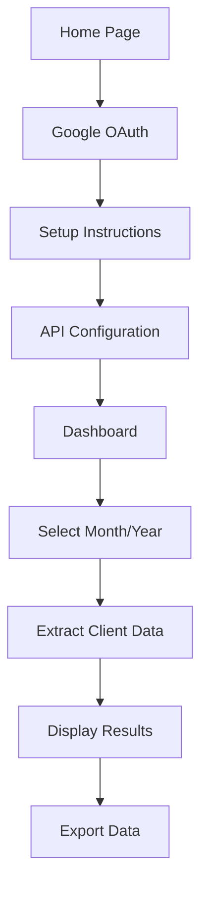

## 1. Product Overview
A Next.js web application that allows users to connect their Google account, set up Google Calendar API access, and extract client information from their calendar for a specified month and year. This tool helps professionals analyze their client meetings and interactions over specific time periods.

The product solves the problem of manually reviewing calendar events to track client interactions, saving time for consultants, freelancers, and business professionals who need to analyze their client engagement history.

## 2. Core Features

### 2.1 User Roles
| Role | Registration Method | Core Permissions |
|------|---------------------|------------------|
| User | Google OAuth authentication | Can connect Google Calendar, view setup instructions, extract client data |

### 2.2 Feature Module
Our Google Calendar integration consists of the following main pages:
1. **Home page**: Welcome message, Google sign-in button, brief description of the service.
2. **Setup page**: Step-by-step instructions for enabling Google Calendar API, API key configuration guidance.
3. **Dashboard page**: Month/year input form, client data extraction results, export functionality.

### 2.3 Page Details
| Page Name | Module Name | Feature description |
|-----------|-------------|---------------------|
| Home page | Hero section | Display welcome message and brief app description. |
| Home page | Authentication | Google OAuth sign-in button with redirect to setup. |
| Setup page | Instructions | Show step-by-step guide for enabling Google Calendar API. |
| Setup page | API Configuration | Provide form to input API credentials after setup. |
| Setup page | Validation | Test API connection and confirm successful setup. |
| Dashboard page | Date Selection | Input fields for month and year selection. |
| Dashboard page | Data Extraction | Fetch and parse calendar events for selected period. |
| Dashboard page | Client Analysis | Identify and categorize client meetings from events. |
| Dashboard page | Results Display | Show client list with meeting counts and details. |
| Dashboard page | Export Options | Allow data export as CSV or JSON formats. |

## 3. Core Process
User Flow:
1. User visits homepage and clicks "Connect Google Account" button
2. User is redirected to Google OAuth authorization
3. After successful authentication, user is taken to setup instructions page
4. User follows instructions to enable Google Calendar API in Google Cloud Console
5. User inputs their API credentials and tests the connection
6. User is redirected to dashboard with month/year selection form
7. User selects desired month and year, clicks "Extract Client Data"
8. System fetches calendar events and analyzes client information
9. Results are displayed with export options

## 4. User Interface Design

### 4.1 Design Style
- Primary colors: Google Blue (#4285F4), White (#FFFFFF), Light Gray (#F8F9FA)
- Secondary colors: Google Red (#EA4335), Google Yellow (#FBBC05), Google Green (#34A853)
- Button style: Rounded corners with Google's Material Design principles
- Font: Google Sans or Roboto, 16px base size
- Layout style: Card-based layout with clean spacing and Google's design language
- Icons: Material Design icons for consistency with Google ecosystem

### 4.2 Page Design Overview
| Page Name | Module Name | UI Elements |
|-----------|-------------|-------------|
| Home page | Hero section | Centered layout with Google sign-in button, clean white background with subtle gray accents. |
| Home page | Authentication | Large "Sign in with Google" button using Google's brand guidelines, clear call-to-action text. |
| Setup page | Instructions | Numbered list with screenshots, collapsible sections for detailed steps, progress indicator. |
| Setup page | API Configuration | Form fields for API key and client ID, test connection button with loading state. |
| Dashboard page | Date Selection | Month and year dropdown selectors, prominent "Extract Data" action button. |
| Dashboard page | Results Display | Table format showing client names, meeting counts, last interaction date, sortable columns. |
| Dashboard page | Export Options | Download buttons for CSV and JSON formats, clear file naming convention. |

### 4.3 Responsiveness
Desktop-first design approach with mobile responsiveness. The application will adapt to tablet and mobile screens while maintaining usability for the complex setup process and data display tables.

### 4.4 Google Integration Guidelines
- Follow Google's OAuth 2.0 best practices for authentication flow
- Implement proper error handling for API rate limits and permissions
- Use Google's official branding guidelines for sign-in buttons
- Include clear privacy policy and data usage information