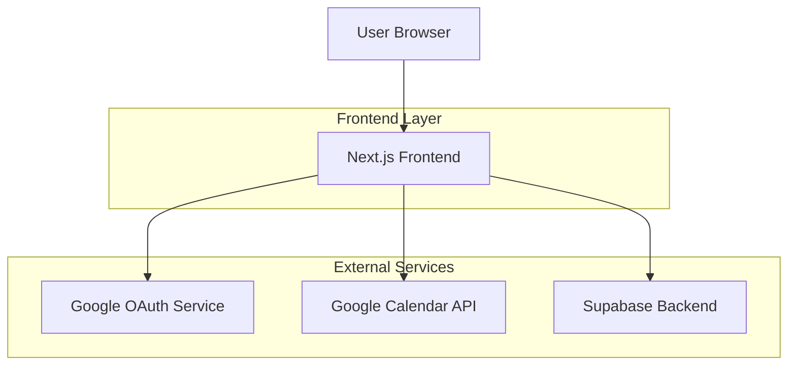
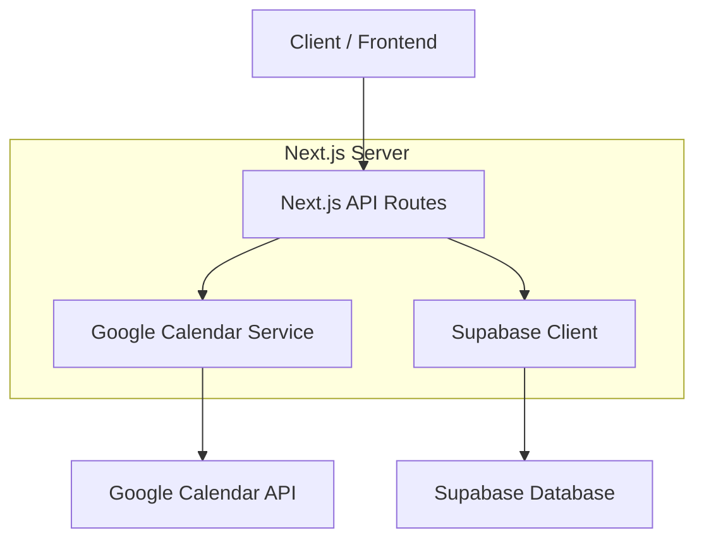
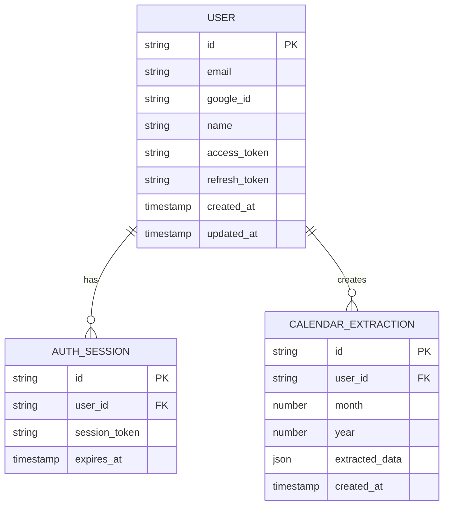

## 1. Architecture design



## 2. Technology Description
- Frontend: Next.js@14 + React@18 + TypeScript + TailwindCSS
- Initialization Tool: create-next-app
- Backend: Supabase (PostgreSQL + Authentication)
- External APIs: Google Calendar API, Google OAuth 2.0
- Deployment: Vercel

## 3. Route definitions
| Route | Purpose |
|-------|---------|
| / | Home page with Google sign-in |
| /auth/callback | Google OAuth callback handler |
| /setup | Calendar API setup instructions |
| /dashboard | Main dashboard for data extraction |
| /api/auth/google | Google OAuth initiation |
| /api/calendar/extract | Calendar data extraction endpoint |
| /api/calendar/clients | Client data processing endpoint |

## 4. API definitions

### 4.1 Authentication APIs

Google OAuth initiation
```
GET /api/auth/google
```

Response: Redirect to Google OAuth authorization page

Google OAuth callback
```
GET /api/auth/callback
```

Request Parameters:
| Param Name| Param Type  | isRequired  | Description |
|-----------|-------------|-------------|-------------|
| code      | string      | true        | Authorization code from Google |
| scope     | string      | true        | OAuth scopes granted |

### 4.2 Calendar APIs

Extract calendar events
```
POST /api/calendar/extract
```

Request:
| Param Name| Param Type  | isRequired  | Description |
|-----------|-------------|-------------|-------------|
| month     | number      | true        | Target month (1-12) |
| year      | number      | true        | Target year (YYYY) |
| accessToken | string    | true        | Google access token |

Response:
| Param Name| Param Type  | Description |
|-----------|-------------|-------------|
| events    | array       | Array of calendar events |
| totalCount| number      | Total number of events |

Process client data
```
POST /api/calendar/clients
```

Request:
| Param Name| Param Type  | isRequired  | Description |
|-----------|-------------|-------------|-------------|
| events    | array       | true        | Calendar events to analyze |

Response:
| Param Name| Param Type  | Description |
|-----------|-------------|-------------|
| clients   | array       | Processed client information |
| summary   | object      | Summary statistics |

## 5. Server architecture diagram



## 6. Data model

### 6.1 Data model definition



### 6.2 Data Definition Language

User Table (users)
```sql
-- create table
CREATE TABLE users (
    id UUID PRIMARY KEY DEFAULT gen_random_uuid(),
    email VARCHAR(255) UNIQUE NOT NULL,
    google_id VARCHAR(255) UNIQUE NOT NULL,
    name VARCHAR(255),
    access_token TEXT,
    refresh_token TEXT,
    created_at TIMESTAMP WITH TIME ZONE DEFAULT NOW(),
    updated_at TIMESTAMP WITH TIME ZONE DEFAULT NOW()
);

-- create index
CREATE INDEX idx_users_google_id ON users(google_id);
CREATE INDEX idx_users_email ON users(email);
```

Calendar Extraction Table (calendar_extractions)
```sql
-- create table
CREATE TABLE calendar_extractions (
    id UUID PRIMARY KEY DEFAULT gen_random_uuid(),
    user_id UUID REFERENCES users(id) ON DELETE CASCADE,
    month INTEGER NOT NULL CHECK (month >= 1 AND month <= 12),
    year INTEGER NOT NULL CHECK (year >= 2020),
    extracted_data JSONB,
    created_at TIMESTAMP WITH TIME ZONE DEFAULT NOW()
);

-- create index
CREATE INDEX idx_calendar_extractions_user_id ON calendar_extractions(user_id);
CREATE INDEX idx_calendar_extractions_month_year ON calendar_extractions(month, year);
```

Authentication Sessions Table (auth_sessions)
```sql
-- create table
CREATE TABLE auth_sessions (
    id UUID PRIMARY KEY DEFAULT gen_random_uuid(),
    user_id UUID REFERENCES users(id) ON DELETE CASCADE,
    session_token VARCHAR(255) UNIQUE NOT NULL,
    expires_at TIMESTAMP WITH TIME ZONE NOT NULL,
    created_at TIMESTAMP WITH TIME ZONE DEFAULT NOW()
);

-- create index
CREATE INDEX idx_auth_sessions_user_id ON auth_sessions(user_id);
CREATE INDEX idx_auth_sessions_session_token ON auth_sessions(session_token);
```

### 6.3 Supabase Row Level Security (RLS) Policies

```sql
-- Enable RLS
ALTER TABLE users ENABLE ROW LEVEL SECURITY;
ALTER TABLE calendar_extractions ENABLE ROW LEVEL SECURITY;
ALTER TABLE auth_sessions ENABLE ROW LEVEL SECURITY;

-- Grant permissions
GRANT SELECT ON users TO anon;
GRANT ALL ON users TO authenticated;
GRANT SELECT ON calendar_extractions TO anon;
GRANT ALL ON calendar_extractions TO authenticated;
GRANT SELECT ON auth_sessions TO anon;
GRANT ALL ON auth_sessions TO authenticated;

-- Create policies
CREATE POLICY "Users can view own profile" ON users FOR SELECT USING (auth.uid() = id);
CREATE POLICY "Users can update own profile" ON users FOR UPDATE USING (auth.uid() = id);
CREATE POLICY "Users can view own extractions" ON calendar_extractions FOR SELECT USING (auth.uid() = user_id);
CREATE POLICY "Users can create own extractions" ON calendar_extractions FOR INSERT WITH CHECK (auth.uid() = user_id);
```